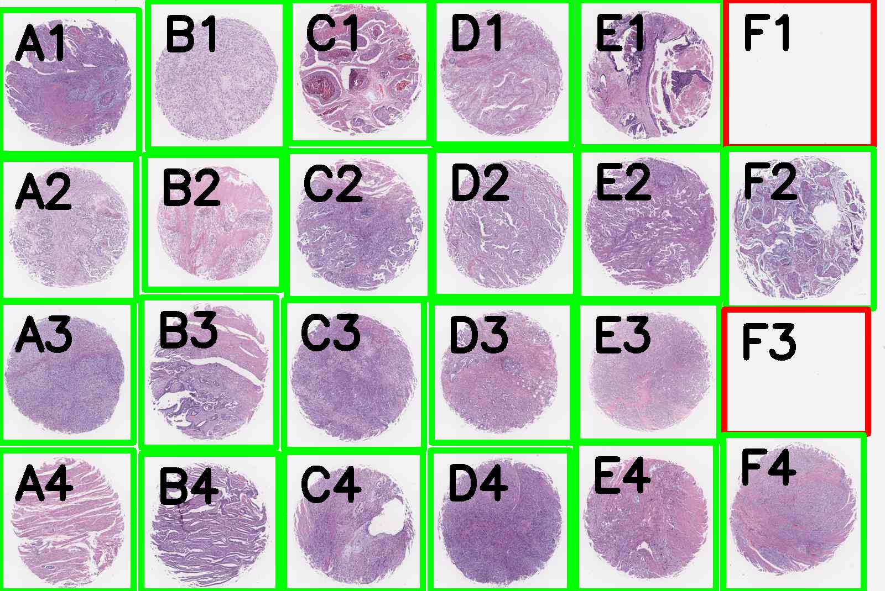

# Tissue Microarray Auto De-Array

A python script for spliting & extracting cores from TMA slides automatically.

# requirements

Only *pandas*, *numpy*, *pillow* and *py-opencv* need to be installed.

install using anaconda
~~~bash
conda install pandas numpy pillow py-opencv -c conda-forge
~~~
or pip
~~~bash
pip install pandas numpy pillow opencv-python
~~~

It works better with *gdal* .

install using anaconda
~~~bash
conda install osgeo -c conda-forge
~~~
or pip
~~~bash
pip install osgeo
~~~

# usage

## de-array

Automatically de-array with at least only one parameter:

~~~bash
python ada.py demo/ST221.jpg -c 6
~~~

Specific more parameters to get better performance.

**-d** core diameter in pixels

**-c** number of columns

**-r** number of rows

You can edit the *.csv* file to correct unexcept results.

| name | col | row | x    | y   | w   | h   | QC_pass |
|------|-----|-----|------|-----|-----|-----|---------|
|   A1 |   0 |   0 |    0 |  18 | 251 | 260 |    True |
|   A2 |   0 |   1 |    0 | 287 | 246 | 257 |    True |
|   A3 |   0 |   2 |    0 | 546 | 241 | 255 |    True |
|   A4 |   0 |   3 |    0 | 815 | 241 | 255 |    True |
|   B1 |   1 |   0 |  267 |   2 | 249 | 268 |    True |
|   B2 |   1 |   1 |  261 | 280 | 248 | 244 |    True |
|   B3 |   1 |   2 |  255 | 538 | 244 | 272 |    True |
|   B4 |   1 |   3 |  255 | 821 | 248 | 249 |    True |
|   C1 |   2 |   0 |  523 |   0 | 253 | 259 |    True |
|   C2 |   2 |   1 |  518 | 273 | 260 | 268 |    True |
|   C3 |   2 |   2 |  513 | 543 | 253 | 271 |    True |
|   C4 |   2 |   3 |  513 | 818 | 251 | 252 |    True |
|   D1 |   3 |   0 |  783 |   0 | 250 | 261 |    True |
|   D2 |   3 |   1 |  783 | 271 | 258 | 266 |    True |
|   D3 |   3 |   2 |  780 | 547 | 255 | 254 |    True |
|   D4 |   3 |   3 |  778 | 815 | 252 | 255 |    True |
|   E1 |   4 |   0 | 1045 |   0 | 262 | 266 |    True |
|   E2 |   4 |   1 | 1045 | 270 | 262 | 271 |    True |
|   E3 |   4 |   2 | 1043 | 547 | 257 | 252 |    True |
|   E4 |   4 |   3 | 1041 | 801 | 253 | 269 |    True |
|   F1 |   5 |   0 | 1312 |   0 | 267 | 266 |   False |
|   F2 |   5 |   1 | 1312 | 269 | 267 | 289 |    True |
|   F3 |   5 |   2 | 1309 | 560 | 260 | 225 |   False |
|   F4 |   5 |   3 | 1307 | 787 | 254 | 283 |    True |

## extract

Then, extract de-arrayed cores automatically.

~~~bash
python extract.py demo/ST221.jpg -q 30
~~~

**-q** quality of JPEG images to be saved.
